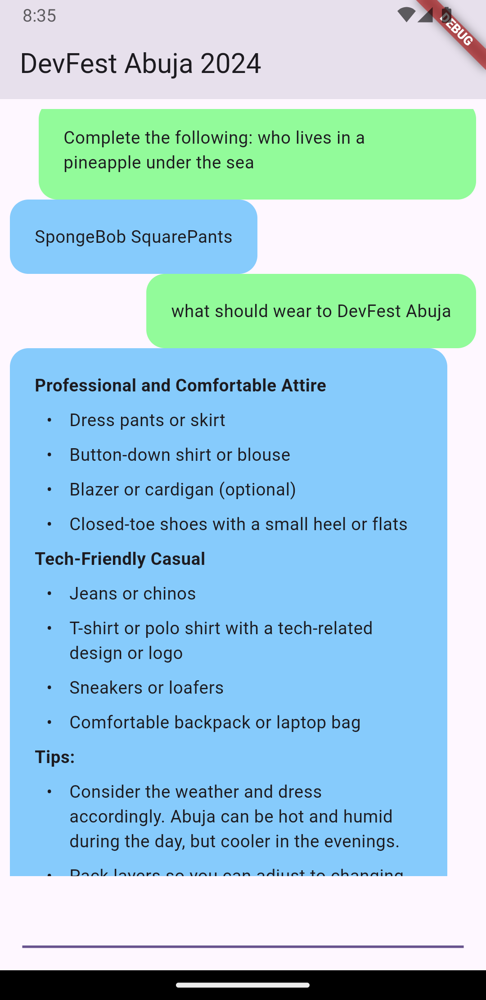

# DevFest Abuja Flutter + Gemini Showcase

A new Flutter project.

## Getting Started

## Get your API key
>The first thing we need for our AI soup is to get an API key from [Get API Key](https://makersuite.google.com/app/apikey) Create the key and 
> copy the key and keep it safe. **Like all KEYS keep it super safe and private don't share it** 

>create **env.json** file in the root directory of your newly created project
> Add the following code to the env.json file. Replace **your_api_key** with the key from **Google AI studio**

```
{
"api_key" :  "your_api_key"
}
```

## Install required packages
**flutter pub add google_generative_ai flutter_markdown**

### Congratulations we are done setting up 


## Get your fingers dirty
change your code in **main.dart** to the following

```
void main() {
    runApp(const MyApp());
}


class MyApp extends StatelessWidget {
    const MyApp({super.key});
        @override
        Widget build(BuildContext context) {
        return MaterialApp(
            title: 'DevFest 2024',
            theme: ThemeData(
            colorScheme: ColorScheme.fromSeed(seedColor: Colors.deepPurple),
            useMaterial3: true,
        ),
        home: const Home(),
        );
    }
}
```

## Creating our Gemini chat page
>create a folder **screens**
> create a dart file **home.dart**
> create a StatefulWidget class called Home

## Add the following code to the file

```
class Home extends StatefulWidget {
    const Home({super.key});

@override
State<Home> createState() => _HomeState();
}

class _HomeState extends State<Home> {
    @override
    Widget build(BuildContext context) {
        return const Placeholder();
    }
}
```

## Declare necessary variables
>GenerativeModel is the an instance of the Gemini Model which helps to query the Gemini AI
>ChatSession manages our current chat Gemini

`late final GenerativeModel _gemini;
late final ChatSession _chatSession;
final _messageController = TextEditingController();
final _messageFocusNode = FocusNode();
final _scrollController = ScrollController();`

## Override initState
> We first initialize the Gemini model by selecting the model we want **gemini-pro**
> Next, we set our API key
> Lastly we initialize our chat session to start the chat session

```
 @override
  void initState() {
    super.initState();
        _gemini = GenerativeModel(
        model: 'gemini-pro',
        apiKey: const String.fromEnvironment('api_key'),
    );
    _chatSession = _gemini.startChat();
}
```

### We are getting there
Replace the contents of the build method with the following block of code

```
return Scaffold(
      appBar: AppBar(
        title: const Text('DevFest 2024 GDG Abuja'),
      ),
      body: Padding(
        padding: const EdgeInsets.all(8.0),
        child: Column(
          mainAxisAlignment: MainAxisAlignment.center,
          crossAxisAlignment: CrossAxisAlignment.start,
          children: [
            Expanded(
              child: ListView.builder(
                controller: _scrollController,
                itemCount: _chatSession.history.length,
                itemBuilder: (context, index) {
                  final Content content = _chatSession.history.toList()[index];
                  final textMessage = content.parts
                      .whereType<TextPart>()
                      .map((e) => e.text)
                      .join('');
                  return MessageWidget(
                    textMessage: textMessage,
                    isFromUser: content.role == 'user',
                  );
                },
              ),
            ),
            Padding(
              padding: const EdgeInsets.symmetric(
                vertical: 10,
                horizontal: 10,
              ),
              child: Row(
                children: [
                  Expanded(
                    child: TextField(
                      autofocus: true,
                      focusNode: _messageFocusNode,
                      controller: _messageController,
                      onSubmitted: _sendMessage,
                    ),
                  ),
                  const SizedBox(
                    height: 20,
                  ),
                ],
              ),
            ),
          ],
        ),
      ),
    );
```
### Slow down that is a whole lot of copy and pasting


The key things to take note of are:
1. We have a Column widget which has a ListView widget that lists out our chat message
2. We return our custom widget **MessageWidget** which we will build at the end
3. Next is the TextField widget which receives user input
4. The TextField widget has a submit method **_sendMessage** which queries Gemini and returns its response

## Send our messages
Add these methods to your project
1. The _sendMessage method sends our message using our instance of _chatSession
2. We handle Exceptions and display a snackbar if Gemini does not give any response
3. If our query is successful, we display the response to the users move the focus to the new entry by calling the **_scrollToNewText** method 
```
Future<void> _sendMessage(String message) async {

    try {
      final response = await _chatSession.sendMessage(
        Content.text(message),
      );
      final textMessage = response.text;

      if (textMessage == null) {
        ScaffoldMessenger.of(context).showSnackBar(
          const SnackBar(
            backgroundColor: Colors.red,
            content: Text(
              'No response from Gemini',
              style: TextStyle(color: Colors.white),
            ),
          ),
        );
        return;
      } else {
        setState(() {
          _scrollToNewText();
        });
      }
    } catch (ex) {
      debugPrint('EXCEPTION CAUGHT $ex');
      ScaffoldMessenger.of(context).showSnackBar(
        const SnackBar(
          backgroundColor: Colors.red,
          content: Text(
            'Exception thrown check logs',
            style: TextStyle(color: Colors.white),
          ),
        ),
      );
    } finally {
      _messageController.clear();
      _messageFocusNode.requestFocus();
    }
  }

  void _scrollToNewText() {
    WidgetsBinding.instance.addPostFrameCallback((_) =>
        _scrollController.animateTo(_scrollController.position.maxScrollExtent,
            duration: const Duration(
              milliseconds: 500,
            ),
            curve: Curves.easeOutCirc));
  }
```
## Look at you go...


## Adding our MessageWidget
1. create a new folder with the **lib** folder called **widgets**
2. create a dart file **message.dart**
3. paste the following StatelessWidget in **message.dart**

The following widget is our message bubble that:
1. Has a textMessage attribute for messages set by the user or received from Gemini
2. A boolean isFromUser to differentiate messages from Users and from Gemini
3. We then set the color of the bubble to Green for User messages and Blue Gemini responses
```
class MessageWidget extends StatelessWidget {
  const MessageWidget(
      {super.key, required this.textMessage, required this.isFromUser});

  final String textMessage;
  final bool isFromUser;

  @override
  Widget build(BuildContext context) {
    final deviceWidth = MediaQuery.of(context).size.width;
    return Row(
      mainAxisAlignment:
          isFromUser ? MainAxisAlignment.end : MainAxisAlignment.start,
      children: [
        Flexible(
          child: Container(
            padding: const EdgeInsets.symmetric(vertical: 20, horizontal: 20),
            constraints: BoxConstraints(maxWidth: deviceWidth * 0.9),
            decoration: BoxDecoration(
                color: isFromUser
                    ? const Color(0x781AFF28)
                    : const Color(0x780199F8),
              borderRadius: BorderRadius.circular(15),
            ),
            child: Column(
              children: [
                MarkdownBody(data: textMessage),
              ],
            ),
          ),
        ),
        const SizedBox(height: 10,),
      ],
    );
  }
}
```
### Running your project
Run the application using
```
flutter run --dart-define-from-file=env.json
```

## Have some cake
Show your friends your new Gemini powered AI chatbot
Tweet an image or screenshot with **#DevFestAbuja** and **#DevFestAbuja2024**
